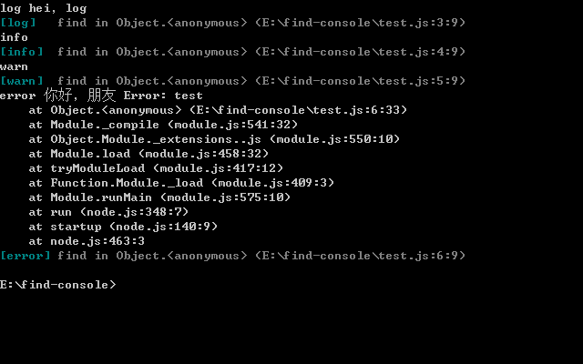

# find-console

查找你的 console 方法

# 安装

```
npm install find-console
```

# 如何食用？

```javascript
require('find-console');

console.log('log', 'hei，log')
console.info('info')
console.warn('warn')
console.error('error', '你好，朋友', new Error('test'))
```

# 效果



# License

MIT
